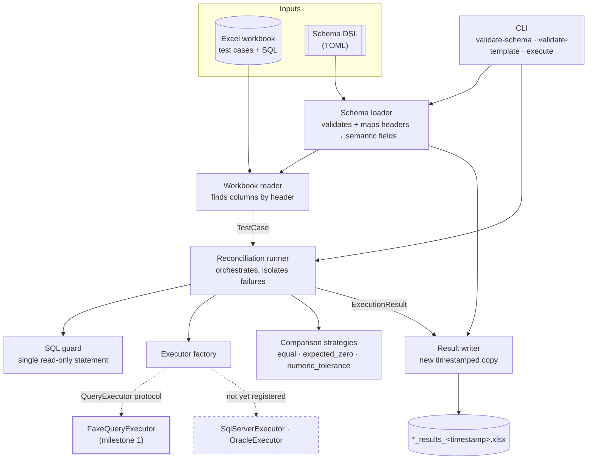

# Architecture

## The central idea: the workbook is the program

Reconciliation test cases are written by the people who understand the migration
— analysts and testers — in Excel. Every domain-specific fact lives there: which
entity, which SQL, which comparison rule, which tolerance.

Python supplies only reusable capability: read a workbook, validate SQL, execute
a scalar query, compare two values, write results. Adding a payments domain, a
fines domain or a company domain means adding **rows**, not classes. There is no
`PaymentRunner`, and there must never be one.

Python changes only when a genuinely new capability is needed: a new database
type, a new comparison strategy, a new schema version, or shared validation.



---

## Semantic fields, and why Excel headers never leak inward

Internally, a test case has a `source_sql`. In one workbook that column is
headed *Source Query*; in another, *Legacy SQL*; in a third it sits in column
`R` instead of `K`. The framework must not care.

So the codebase is split by what it knows:

* **`workbook/`** is the only package that knows header text exists. It
  translates in both directions and nowhere else.
* **`models.py`** defines the stable vocabulary — `TestCase`, `ExecutionResult`,
  `ComparisonRule`, `ErrorSide` — in semantic names only.
* **`runner.py`**, **`evaluation/`** and **`database/`** speak that vocabulary
  exclusively. None of them contains an Excel string.

The consequence: retitling a column is a one-line TOML edit. Supporting an
entirely different template is a new TOML file. Neither is a code change, and
neither can break another team's template.

### The DSL-to-header mapping

```toml
[fields.source_sql]     # stable semantic name — code refers to this
header = "Source Query" # the text in this workbook — only the DSL knows it
type = "sql"
required = true
read = true             # an input column…
write = false           # …never written back
```

The loader (`workbook/schema.py`) rejects a schema before any workbook is opened
or any connection considered. It checks the schema version, sheet geometry
(`first_data_row` must be past `header_row`), the presence of every mandatory
semantic field on the correct side, unique header mappings (case- and
whitespace-insensitive), known field types, enum values that the framework
actually supports, defaults that match their declared type, and an output
filename pattern that is a bare `.xlsx` filename carrying `{timestamp}` or
`{run_id}` — so a run can never overwrite its own input.

A field must be either readable or writable, never both: that single rule is
what makes "this column is an input" and "this column is a result" unambiguous
throughout, and it is what the writer's write-protection check relies on.

The DSL is parsed with `tomllib`. It is data. It cannot express Python, a shell
command, an Excel formula or SQL, and unknown keys are rejected rather than
ignored — a typo fails loudly instead of silently disabling a safeguard.

---

## Runner responsibilities

`ReconciliationRunner.run()` owns the sequence and nothing else:

1. Read and validate the workbook (structural problems stop the run here,
   before any executor exists).
2. Apply `--case` / `--limit` selection; everything excluded is recorded as
   `SKIPPED` with the reason, so the output workbook explains itself.
3. For each selected case, in order: validate both queries, execute source,
   execute target, compare, time it.
4. Close every executor — in a `finally`, so cleanup survives any failure.
5. Write results to a new workbook and return a `RunSummary`.

**Failure isolation is the runner's defining behaviour.** A test case that
explodes must not cost the other 200 their run. Every per-case failure is caught
and converted into an `ERROR` result carrying a sanitized message, and execution
continues. `--fail-fast` inverts this for troubleshooting: the first non-PASS
stops the run and the remainder are marked `Stopped by --fail-fast`.

Structural problems behave differently on purpose. A missing sheet, a missing
required column or a duplicate test-case id raises before anything executes,
because those make the whole run's results untrustworthy — and a duplicate id
would make `--case` ambiguous.

---

## Adapters and the factory seam

The runner depends on two protocols and never on a driver:

```python
class QueryExecutor(Protocol):
    def test_connection(self) -> ConnectionIdentity: ...
    def execute_scalar(self, sql: str, timeout_seconds: int) -> ScalarValue: ...
    def close(self) -> None: ...
```

`ExecutorFactory` supplies executors by logical connection name and owns their
lifetime. Every request passes `test_case_id` and `side` (source or target):
offline fakes use them to vary their answers per case; real adapters ignore
both and cache **one connection per logical connection name**, which is what
makes "prompt for a credential at most once per run" achievable.

Adding SQL Server and Oracle later is therefore additive:

| Piece | Milestone 1 | Later |
| --- | --- | --- |
| `database/base.py` | Protocols + `single_scalar()` | unchanged |
| `database/fake.py` | `FakeQueryExecutor` | unchanged, still used by tests |
| `database/factory.py` | `_REAL_ADAPTERS` is empty | register `sqlserver` → `pyodbc`, `oracle` → `oracledb` |
| `runner.py` | — | **unchanged** |

Each real adapter will apply the row's timeout, route its result set through
`single_scalar()`, close its cursor and connection on both success and failure,
and pass SQL to the driver **verbatim**. Source and target SQL are already
written in their own dialects; the framework never translates between them.

---

## Comparison strategies

Each rule is a small class registered by its `ComparisonRule`, so a new rule is
a new class plus a registry entry — never a branch in the runner.

| Rule | Passes when |
| --- | --- |
| `equal` | Normalized values are equal. |
| `expected_zero` | **Both** sides are numeric zero. |
| `numeric_tolerance` | `abs(source - target) <= tolerance`. |

Two decisions worth stating explicitly, because ambiguity here would be
dangerous:

**`expected_zero` evaluates both sides.** These are mismatch/orphan-count
queries: each side independently answers "how many rows are wrong?", and both
must answer zero. Requiring both — rather than picking a side — means a non-zero
count can never be discarded unread. If only one side is meaningful for a check,
put the same query in both columns.

**NULL never reconciles, under any rule, including NULL against NULL.** An empty
scalar almost always means the query matched nothing, which is precisely the
false-pass that a reconciliation exists to prevent. It is reported as `ERROR` on
the `COMPARISON` side. Queries should use `COALESCE`/`NVL` when zero is the
intended answer.

Normalization is deliberately narrow. Numbers, booleans and numeric-looking
strings become `Decimal` — drivers and Excel move freely between `1`, `1.0` and
`"1"` for the same count, and `Decimal` also removes binary float noise, so
`0.1 + 0.2` compares correctly. Dates become datetimes. But values of different
*kinds* — text against a number — are never coerced; that raises
`ComparisonError` and the case is reported as an error rather than silently
passing or failing.

Variance is `source - target` when both sides are numeric, and blank otherwise.
It is computed in Python and written as a literal value, as is status: a result
workbook is correct the moment it is written, with no dependence on Excel
recalculating a formula.

---

## Error handling

Every error is classified by the stage that produced it, which is what makes a
result workbook triageable at a glance:

| `error_side` | Meaning | Example `error_code` |
| --- | --- | --- |
| `SOURCE` | Source query rejected or failed | `SQL_REJECTED`, `SOURCE_EXEC_FAILED` |
| `TARGET` | Target query rejected or failed | `TARGET_EXEC_FAILED` |
| `COMPARISON` | Results cannot be compared | `COMPARISON_FAILED` |
| `WORKBOOK` | The row itself is malformed | `WORKBOOK_ROW_INVALID` |

Every case records its id, row, status, side, sanitized message, UTC timestamp,
run id and duration — whether it passed, failed or errored. Nothing reaches a
cell or the console without passing through `security/redaction.py`; no
credential, connection string, full SQL or query payload is ever included.

Timestamps are UTC. Excel cannot store a timezone, so the offset is dropped at
the moment of writing rather than converted — the recorded instant stays UTC,
which is why the schema only accepts `timezone = "UTC"`.

---

## Why no ORM

An ORM maps classes to tables and manages entities, relationships, identity and
persistence. This framework does none of that. It executes SQL that somebody
else has already written, in a dialect that is already decided, and reads back a
single number.

An ORM would add a dependency, an abstraction to fight, and a real hazard: its
whole purpose is to generate SQL, and the one thing that must be guaranteed here
is that the SQL sent to the server is character-for-character what the analyst
wrote in the workbook. `pyodbc` and `oracledb` are thin enough to make that
obvious, and thin enough that "one row, one column, read-only, then close" is
enforceable in a few lines.

The same reasoning rules out pandas (a DataFrame is a way to bring back rows
that must never leave the database), async and parallel execution (ordered,
reviewable, one connection per credential prompt), and a web framework (there is
no service here — a CLI on a client machine writes a file).

---

## Package map

```text
src/migration_reconciliation/
├── cli.py               Argument parsing, reporting, exit codes
├── runner.py            Orchestration and failure isolation
├── models.py            Semantic vocabulary (dataclasses + enums)
├── errors.py            Exception hierarchy; all messages safe to display
├── database/
│   ├── base.py          QueryExecutor / ExecutorFactory protocols, single_scalar
│   ├── fake.py          Offline executor + TOML response book
│   └── factory.py       The seam where real adapters will register
├── workbook/
│   ├── schema.py        DSL loader and validator
│   ├── reader.py        Workbook → TestCase
│   ├── writer.py        ExecutionResult → new timestamped workbook
│   └── template.py      Generates example workbooks from a schema
├── evaluation/
│   └── comparators.py   Comparison strategies and the registry
└── security/
    ├── sql_guard.py     Conservative read-only SQL validation
    └── redaction.py     Credential masking for all output
```
